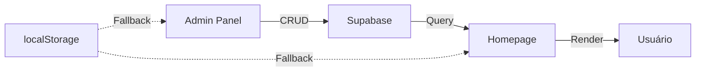

# Arquitetura do Projeto - Dimar Auto Peças

**Versão:** 1.0  
**Data de Criação:** 09/12/2024  
**Última Atualização:** 09/12/2024 23:05

---

## 📋 Visão Geral do Projeto

### Nome do Projeto
**Dimar Web** - E-commerce de Auto Peças e Moto Peças

### Stack Tecnológica
- **Frontend:** HTML5, CSS3 (Vanilla), JavaScript (ES6+)
- **Backend/BaaS:** Supabase (PostgreSQL)
- **Hospedagem:** Vercel
- **Versionamento:** GitHub
- **Servidor Local:** Python HTTP Server (porta 8000)

### URLs do Projeto
- **Desenvolvimento:** http://localhost:8000
- **Produção:** (configurado via Vercel com deploy automático do GitHub)
- **Admin:** /dimaradmin/
- **Supabase:** https://jfiarqtqojfptdbddnvu.supabase.co

---

## 🗂️ Estrutura de Diretórios

```
dimarautosite/
├── .git/                      # Controle de versão Git
├── .gitignore                 # Arquivos ignorados pelo Git
├── assets/                    # 20 arquivos (imagens, logos, banners)
│   └── images/                # Imagens do projeto
├── css/                       # 5 arquivos de estilos
│   ├── cart-page.css          # Estilos da página de carrinho
│   ├── catalog.css            # Catálogo de produtos
│   ├── product-page.css       # Página individual de produto
│   ├── search-results.css     # Resultados de busca
│   └── style.css              # Estilos principais (4068 linhas)
├── database/                  # Scripts SQL do Supabase
│   ├── insert-products.sql    # Dados de exemplo
│   ├── schema.sql             # Schema das tabelas
│   └── setup-rls-policies.sql # Políticas de segurança
├── dimaradmin/                # 14 arquivos - Painel administrativo
│   ├── css/
│   │   └── admin.css          # Estilos do admin
│   ├── js/                    # 7 arquivos JavaScript
│   │   ├── auth-guard.js      # Proteção de rotas
│   │   ├── banners.js         # Gerenciamento de banners
│   │   ├── categorias.js      # Gerenciamento de categorias
│   │   ├── dashboard.js       # Dashboard principal
│   │   ├── marcas.js          # Gerenciamento de marcas
│   │   ├── produtos.js        # Gerenciamento de produtos ⭐
│   │   └── supabase-config.js # Config Supabase (admin)
│   ├── banners.html           # CRUD de banners
│   ├── categorias.html        # CRUD de categorias
│   ├── index.html             # Dashboard admin
│   ├── login.html             # Login do admin
│   ├── marcas.html            # CRUD de marcas
│   └── produtos.html          # CRUD de produtos ⭐
├── docs/                      # 35 arquivos - Documentação
│   ├── checklists/            # Checklists de desenvolvimento
│   ├── ADMIN-PANEL-COMPLETO.md
│   ├── AUDITORIA-BUGS.md
│   ├── COMECE_AQUI.md
│   ├── DEPLOY-VERCEL.md
│   ├── ESTRUTURA_VISUAL.md
│   ├── GUIA-SUPABASE.md        # ⭐ Importante
│   ├── HISTORICO-BADGES-2024-12-09.md  # Histórico de mudanças
│   ├── INTEGRACAO-ADMIN-HOME.md
│   ├── memory.md               # Memória de desenvolvimento
│   ├── README.md
│   └── ... (outros 25 documentos)
├── js/                        # 22 arquivos JavaScript
│   ├── cart.js                # Sistema de carrinho
│   ├── cart-page.js           # Página de carrinho
│   ├── catalog.js             # Catálogo de produtos
│   ├── global-init.js         # Inicialização global
│   ├── home-supabase.js       # Integração Supabase homepage ⭐
│   ├── loading-states.js      # Estados de carregamento
│   ├── logger.js              # Sistema de logs
│   ├── navigation-fix.js      # Correção de navegação
│   ├── products-catalog.js    # Catálogo de produtos
│   ├── product-page.js        # Página de produto individual
│   ├── script.js              # Script principal (18865 linhas)
│   ├── search.js              # Sistema de busca
│   ├── search-results.js      # Resultados de busca
│   ├── supabase-config.js     # Config Supabase (frontend) ⭐
│   ├── supabase-products.js   # Produtos do Supabase
│   ├── templates.js           # Sistema de templates
│   └── ... (outros arquivos)
├── pages/                     # 8 páginas HTML
│   ├── carrinho.html          # Página de carrinho
│   ├── contato.html           # Contato
│   ├── produto.html           # Página de produto
│   ├── produtos.html          # Listagem de produtos
│   ├── resultados-busca.html  # Resultados de busca
│   └── ... (outras páginas)
├── templates/                 # 3 templates reutilizáveis
│   ├── footer.html            # Rodapé
│   └── header.html            # Cabeçalho
├── index.html                 # Homepage principal ⭐
├── vercel.json                # Config do Vercel
└── vercel.json.bak            # Backup da config

TOTAL: 9 diretórios principais + arquivos de config
```

---

## 🔑 Arquivos Críticos

### ⭐ Top 10 Arquivos Mais Importantes

1. **index.html** - Homepage principal (45.041 bytes)
2. **css/style.css** - Estilos principais (77.310 bytes, 4068 linhas)
3. **js/script.js** - JavaScript principal (18.865 bytes)
4. **js/supabase-config.js** - Configuração Supabase frontend
5. **js/home-supabase.js** - Integração Supabase na homepage
6. **dimaradmin/produtos.html** - Interface de gerenciamento de produtos
7. **dimaradmin/js/produtos.js** - Lógica CRUD de produtos
8. **dimaradmin/js/supabase-config.js** - Config Supabase admin
9. **database/schema.sql** - Schema do banco de dados
10. **vercel.json** - Configuração de deploy

---

## 🗄️ Banco de Dados (Supabase)

### Conexão

```javascript
Project URL: https://jfiarqtqojfptdbddnvu.supabase.co
API Key (anon): eyJhbGciOiJIUzI1NiIsInR5cCI6IkpXVCJ9...m8g
Validade: até 2080
```

### Tabelas Principais

1. **products** - Produtos do e-commerce
2. **categories** - Categorias de produtos
3. **brands** - Marcas parceiras
4. **banners** - Banners do carrossel

### Schema de Produtos

```sql
CREATE TABLE products (
  id UUID PRIMARY KEY DEFAULT uuid_generate_v4(),
  name VARCHAR(255) NOT NULL,
  sku VARCHAR(100) UNIQUE NOT NULL,
  category VARCHAR(100),
  brand VARCHAR(100),
  price DECIMAL(10,2) NOT NULL,
  sale_price DECIMAL(10,2),
  stock INTEGER DEFAULT 0,
  status VARCHAR(20) DEFAULT 'active',
  short_description TEXT,
  description TEXT,
  images JSONB,
  
  -- Campos de destaque
  is_featured BOOLEAN DEFAULT FALSE,
  is_bestseller BOOLEAN DEFAULT FALSE,
  fast_shipping BOOLEAN DEFAULT FALSE,
  
  -- Badges (adicionados 09/12/2024)
  badge_type VARCHAR(50),
  custom_badge_text VARCHAR(100),
  
  -- Timestamps
  created_at TIMESTAMP DEFAULT NOW(),
  updated_at TIMESTAMP DEFAULT NOW()
);
```

---

## 🔄 Fluxo de Dados

### Admin → Banco → Frontend



### Funcionamento:

1. **Admin cria/edita produto** → `dimaradmin/produtos.html`
2. **JavaScript salva** → `dimaradmin/js/produtos.js`
3. **Dados enviados** → Supabase via `supabase-config.js`
4. **Homepage carrega** → `js/home-supabase.js`
5. **Renderiza cards** → `index.html` (seção "Principais ofertas")

### Fallback (sem Supabase):
- Admin salva em `localStorage`
- Homepage lê do `localStorage`
- Funciona offline/desenvolvimento

---

## 🎨 Sistema de Design

### Paleta de Cores

```css
--primary-color: #ff6600;       /* Laranja principal */
--primary-hover: #ff7700;       /* Laranja hover */
--background: #fafafa;          /* Cinza claro */
--text-primary: #333;           /* Texto escuro */
--text-secondary: #666;         /* Texto médio */
--border-color: #e0e0e0;        /* Bordas */
--success: #28a745;             /* Verde (Oferta) */
--danger: #dc3545;              /* Vermelho (Hot) */
```

### Tipografia
- **Fonte:** Inter (Google Fonts)
- **Pesos:** 400, 500, 600, 700, 800, 900

### Breakpoints
```css
/* Mobile First */
@media (max-width: 480px)  { /* Mobile pequeno */ }
@media (max-width: 768px)  { /* Mobile */ }
@media (max-width: 992px)  { /* Tablet */ }
@media (max-width: 1200px) { /* Desktop pequeno */ }
@media (max-width: 1400px) { /* Desktop médio */ }
```

---

## 🔐 Segurança

### Row Level Security (RLS) - Supabase

- **Produtos:** Leitura pública, escrita apenas autenticados
- **Categorias:** Leitura pública, escrita apenas autenticados
- **Banners:** Leitura pública, escrita apenas autenticados
- **Marcas:** Leitura pública, escrita apenas autenticados

### Autenticação Admin

- **Arquivo:** `dimaradmin/js/auth-guard.js`
- **Proteção:** Redirecionamento para login.html se não autenticado
- **Session:** localStorage (`admin_logged_in`, `admin_email`)

---

## 🚀 Deploy

### GitHub → Vercel (Automático)

1. **Repositório:** github.com/mklimitada198-code/dimarweb
2. **Branch principal:** main
3. **Deploy automático:** Push to main = deploy
4. **Vercel:** Configurado via vercel.json

### Variáveis de Ambiente (Vercel)

```bash
SUPABASE_URL=https://jfiarqtqojfptdbddnvu.supabase.co
SUPABASE_ANON_KEY=eyJhbGciOiJIUzI1NiIsInR5cCI6IkpXVCJ9...m8g
```

*(Atualmente hardcoded nos arquivos JS - considerar mover para .env)*

---

## 📦 Dependências

### CDN (Carregadas via CDN)
- **Supabase JS:** https://cdn.jsdelivr.net/npm/@supabase/supabase-js@2
- **Google Fonts:** Inter (via fonts.googleapis.com)

### Sem Build Tools
- Não usa npm/yarn
- Não usa webpack/vite
- Vanilla JavaScript puro
- CSS puro (sem preprocessadores)

---

## 🧪 Ambiente de Desenvolvimento

### Servidor Local
```bash
cd dimarautosite
python -m http.server 8000
```

### URLs Locais
- Homepage: http://localhost:8000
- Admin: http://localhost:8000/dimaradmin/
- Produtos: http://localhost:8000/dimaradmin/produtos.html

---

## 📊 Estatísticas do Projeto

| Métrica | Valor |
|---------|-------|
| Total de arquivos | ~100+ |
| Linhas de CSS | ~4.000+ |
| Linhas de JS | ~20.000+ |
| Páginas HTML | 15+ |
| Documentação (docs/) | 35 arquivos |
| Tamanho do projeto | ~2 MB |

---

## 🗺️ Roadmap de Features

### ✅ Implementadas (09/12/2024)
- [x] Sistema de badges personalizados
- [x] Gerenciamento de produtos no admin
- [x] Integração Supabase
- [x] Sistema de carrinho
- [x] Busca de produtos
- [x] Catálogo responsivo

### 🚧 Em Desenvolvimento
- [ ] Checkout completo
- [ ] Integração de pagamento
- [ ] Sistema de cupons

### 🔮 Futuras
- [ ] Painel de analytics
- [ ] Sistema de reviews
- [ ] Wishlist
- [ ] Notificações push

---

## 📝 Convenções de Código

### Nomenclatura
- **Classes CSS:** kebab-case (`.product-card`)
- **IDs:** camelCase (`#productModal`)
- **Funções JS:** camelCase (`loadProducts()`)
- **Constantes:** UPPER_SNAKE_CASE (`SUPABASE_URL`)
- **Arquivos:** kebab-case (`home-supabase.js`)

### Estrutura de Comentários
```javascript
// ==================== SEÇÃO PRINCIPAL ====================
// Descrição da funcionalidade

/**
 * Nome da função
 * Descrição detalhada
 */
function minhaFuncao() {
    // Comentário inline
}
```

---

## 🔧 Troubleshooting Comum

### 1. Erro "Invalid API Key"
**Solução:** Verificar credenciais em:
- `js/supabase-config.js`
- `dimaradmin/js/supabase-config.js`

### 2. Produtos não aparecem na homepage
**Solução:**
- Verificar console do navegador
- Recarregar página (F5)
- Verificar se Supabase está online

### 3. Admin não salva produtos
**Solução:**
- Verificar se está logado
- Verificar credenciais do Supabase
- Conferir RLS policies no Supabase

---

## 🤝 Contribuindo

### Workflow
1. Sempre documentar mudanças em `/docs/`
2. Testar localmente antes de commit
3. Push para GitHub → deploy automático Vercel
4. Verificar produção após deploy

### Documentação Obrigatória
- Toda mudança significativa deve ter um arquivo `HISTORICO-[FEATURE]-YYYY-MM-DD.md` em `docs/`
- Atualizar `memory.md` quando necessário
- Manter `README.md` atualizado

---

**Documento mantido por:** AI Assistant (Antigravity)  
**Próxima revisão:** A cada feature implementada
